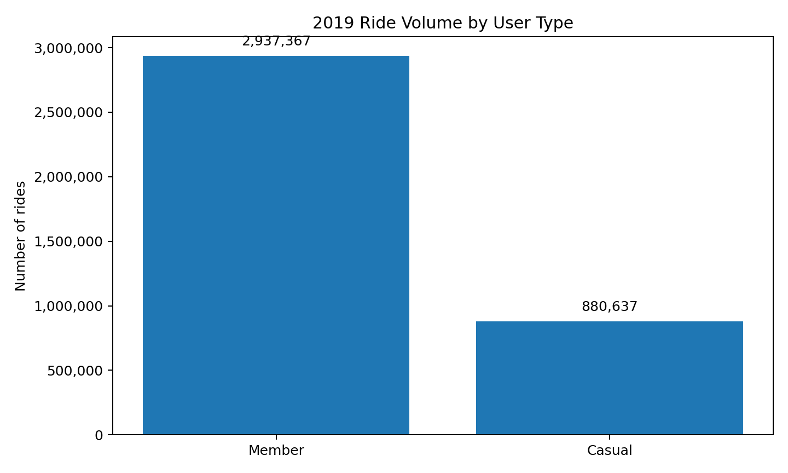
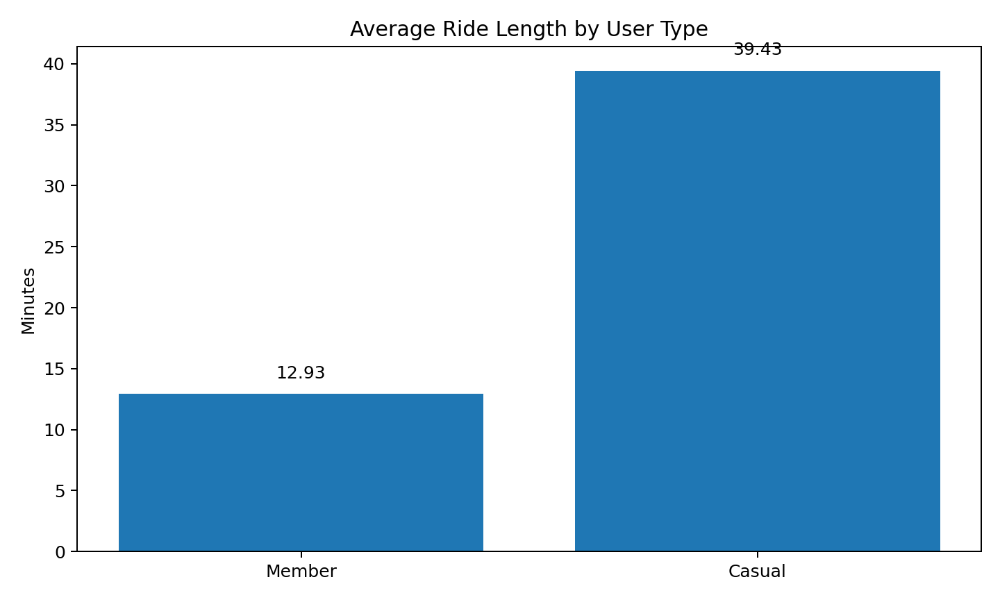
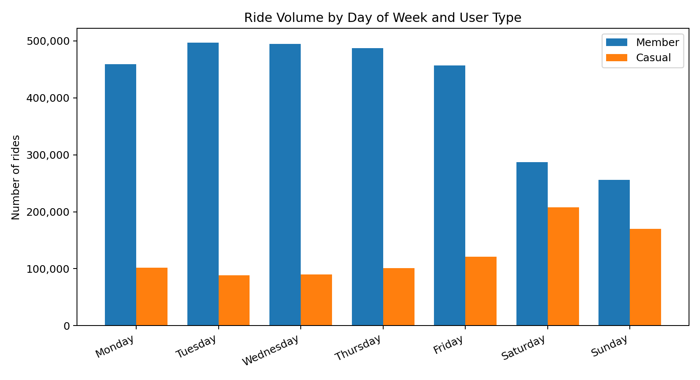
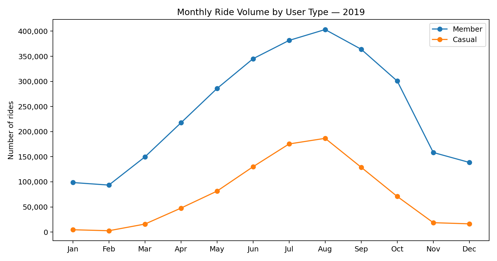

# Cyclistic Bike-Share Analysis — 2019

A portfolio data-analytics case study using **MySQL + SQL + Excel** to investigate how Cyclistic **Members** and **Casual** riders use bike-share services differently.

> **Business question:** How do annual Members and Casual riders use Cyclistic bikes differently?

## Project at a glance

| Area | Details |
|---|---|
| Dataset | 2019 Cyclistic trip records |
| Trips analyzed | **3,818,004** |
| SQL engine | MySQL |
| Reporting & visuals | Excel |
| Core comparison | Member vs Casual behavior |
| Analysis areas | Volume, duration, time, day, seasonality, demographics, stations & routes |

## Executive findings

### 1. Members generate most of the ride volume

Of the **3,818,004 trips**, approximately **76.9%** were Member rides and **23.1%** were Casual rides.

### 2. Casual riders take substantially longer rides

Using trips with valid duration values, average ride length was:

- **Casual:** 39.43 minutes
- **Member:** 12.93 minutes

This is one of the clearest behavioral differences in the dataset.

### 3. Casual usage has a stronger weekend component

Weekend rides represented approximately **42.9% of Casual rides**, compared with **18.5% of Member rides**.

### 4. Demand is strongly seasonal

Ride volume increased through spring and summer and reached its highest quarterly volume in **Q3: 1,640,718 rides**. August was the highest-volume month with **590,184 rides**.

### 5. The evening commute period is a major demand window

**17:00** was the highest-volume hour, with **475,154 rides** across the dataset.

### 6. Most rides are relatively short

Among the **3,816,156 trips with valid duration metrics**, **72.56%** were under 20 minutes and **86.18%** were under 30 minutes.

## Analysis workflow

The project follows the Google Data Analytics case-study workflow:

**Ask → Prepare → Process → Analyze → Share → Act**

### Ask

Define the business question around behavioral differences between Members and Casual riders.

### Prepare

Use the available 2019 trip records and relevant station information. The raw CSV files are kept outside GitHub because of their size; the repository contains the SQL workflow and derived project outputs.

### Process

The data was loaded into a MySQL staging table before being transformed into an analysis-ready table.

Key preparation steps included:

- Parsing trip start and end timestamps
- Converting trip duration from seconds to minutes
- Creating day-of-week, hour, month and quarter fields
- Standardizing `Subscriber` → `Member` and `Customer` → `Casual`
- Cleaning birth-year values and creating age groups
- Identifying extreme ride durations
- Retaining the original trip records while excluding extreme durations from duration-based metrics

### Analyze

SQL queries were used to compare:

- Member vs Casual ride volume
- Average ride length
- Day-of-week behavior
- Monthly and quarterly trends
- Hourly demand
- Weekday vs weekend behavior
- Ride-length distribution
- Age and gender patterns
- Top starting and ending stations
- Top station-to-station routes

### Share

The findings were summarized in an Excel analysis workbook, case-study report and presentation, supported by reusable chart assets in the `images/` folder.

### Act

The recommendations are framed as **testable business experiments**, not causal conclusions, because the dataset does not contain campaign exposure, pricing-response, membership-conversion or retention data.

## Data-quality decisions

### Ride duration

There were **1,848 rides longer than 24 hours (0.05% of all trips)**. These records were retained in the underlying data but excluded from ride-length metrics so that extreme durations did not distort average-duration analysis.

### Birth year

Blank and implausible birth-year values were converted to missing for demographic analysis. The associated trip records were retained for non-demographic analysis.

## Key recommendations

1. **Test seasonal and weekend membership offers** during periods when Casual usage is relatively strong.
2. **Test messaging aimed at longer-duration riders**, using the observed difference in ride length as the behavioral signal.
3. **Use high-demand stations and time windows as campaign touchpoints** for targeted membership messaging.

These recommendations should be evaluated with campaign exposure, conversion, membership sign-up and retention data before drawing causal conclusions.

## Repository structure

```text
cyclistic-bike-share-analysis/
├── README.md
├── sql/
│   ├── 01_database_setup.sql
│   ├── 02_station_history.sql
│   ├── 03_trip_staging_and_loading.sql
│   ├── 04_trip_cleaning.sql
│   ├── 05_analysis_queries.sql
│   └── 06_summary_tables.sql
├── docs/
│   ├── data_cleaning.md
│   └── findings_and_recommendations.md
├── data/
│   └── README.md
├── images/
│   ├── 01_user_volume.png
│   ├── 02_user_ride_length.png
│   ├── 03_day_user.png
│   ├── 04_month_user.png
│   ├── 05_hour_user.png
│   ├── 06_weekend_length.png
│   ├── 07_ride_length_dist.png
│   ├── 08_age.png
│   └── 08_quarter.png
└── reports/
    ├── Cyclistic_2019_SQL_Analysis_Final.xlsx
    ├── Cyclistic_2019_Case_Study_Report.pdf
    ├── Cyclistic_2019_Portfolio_Presentation.pdf
    └── Cyclistic_2019_Portfolio_Presentation.pptx
```

## Selected visuals

### Member vs Casual ride volume



### Average ride length by user type



### Usage by day of week



### Monthly ride volume



## Deliverables

- [SQL analysis scripts](sql/)
- [Data-cleaning documentation](docs/data_cleaning.md)
- [Findings and recommendations](docs/findings_and_recommendations.md)
- [Excel analysis workbook](reports/Cyclistic_2019_SQL_Analysis_Final.xlsx)
- [Case-study report](reports/Cyclistic_2019_Case_Study_Report.pdf)
- [Portfolio presentation](reports/Cyclistic_2019_Portfolio_Presentation.pdf)
- [PowerPoint presentation](reports/Cyclistic_2019_Portfolio_Presentation.pptx)

## Reproducibility

The repository documents the SQL workflow used to create the analysis. The original 2019 CSV files are intentionally **not stored in GitHub**; the `data/README.md` file describes the data-file approach.

To reproduce the analysis, provide the source CSV files locally, load them into the staging workflow, run the cleaning script, and then execute the analysis and summary-table scripts in order.

## Portfolio context

This project demonstrates how I approach an analytics problem from **business question → data preparation → SQL analysis → visualization → recommendations**.

It is part of my transition toward **BI / Analytics Business Analyst roles**, building on prior experience in business requirements, UAT, stakeholder management and MIS reporting.

---

**Author:** Ravi Kumar  
**LinkedIn:** [ravi-kumar-analytics](https://www.linkedin.com/in/ravi-kumar-analytics)  
**GitHub:** [ravisravi31-ui](https://github.com/ravisravi31-ui)
